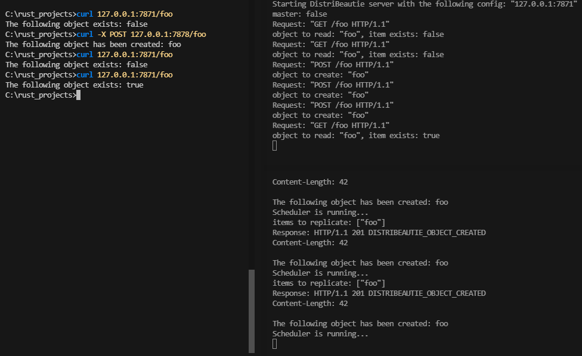

## DistriBeautie

Have you ever heard of a distributed client-server app called DistriBeautie? Me neither.\
Let's write together it from scratch...

We will write it in Rust with no additional libraries support, just using standard features of the language.

We are going to cover the following aspects: working with files, network, threads and scheduling the tasks.

### Agenda
* create master and replica nodes
* accept read + write requests
* a value written to master is eventually replicated to a replica
* use HTTP 1.1 protocol as a transport
* take value from HTTP request line

### Configs
It's essential to externalize configs from the app, and our configs have the following key value structure:

```
server.host=127.0.0.1
server.port=7878
server.ismasterhost=true
sync.interval.ms=15000
replicas.addr=127.0.0.1:7871
```

We read the config
```rust
fn read_config() -> Vec<String> {
    fs::read_to_string("server.conf")
        .unwrap()
        .lines()
        .map(String::from)
        .collect()
}
```

and its properties the following way:
```rust
fn read_config_property(config: Vec<String>, property_name: &str) -> String {
    let config_property_value = config
        .iter()
        .find(|&x| x.contains(property_name))
        .unwrap()
        .split("=")
        .collect::<Vec<_>>()[1];
    String::from(config_property_value)
}
```

### Starting the server
Using standard library's socket listener, we listen to a port specified in our configs,\
and serve the connection in a new thread:
```rust
let listener = TcpListener::bind(server_addr).unwrap();

for stream in listener.incoming() {
    let stream = stream.unwrap();
    thread::spawn(|| networking::handle_connection(stream));
}
```
To handle a connection, we do the following:
* read http request from TCP stream
* from find out if it's a read (GET) or write (POST) access mode
* in case of write path - store received string variable in array
* in case of read path - return T/F if a string variable exists
* write a response back to TCP stream

HTTP request contains 4 parts:
* request line
* headers
* empty line
* body

Now we are mostly interested only in first request line, which consists of:
* request method
* a whitespace
* requested URL
* yet one more whitespace
* the protocol version

Since we don't need the whole http request, we can read just a request line the following way:
```rust
let buf_reader = BufReader::new(&mut stream);

let request_line_optional = buf_reader.lines().next();
let request_line = if request_line_optional.is_some() {
    request_line_optional.unwrap().unwrap()
} else {
    return;
};
```

Eventually these are just characters, that we need to read from TCP stream.

At this point inside request_line we have:
```
POST /foo HTTP/1.1
```

Simple string manipulation helps us with extracting request method and a resource.

Then we store the variable in the array - upon write request, and read it - upon read request.

```rust
static STORAGE: Mutex<Vec<String>> = Mutex::new(Vec::new());

pub fn add_item(item: String) {
    let mut vec = STORAGE.lock().unwrap();
    vec.push(item);
}

pub fn get_item(item: String) -> bool {
    let vec = STORAGE.lock().unwrap();
    vec.contains(&item)
}
```

When it comes to responding to a client - we write directly to TCP stream:
```rust
let status_line = "HTTP/1.1 201 DISTRIBEAUTIE_OBJECT_CREATED";
let contents = format!("The following object has been created: {object_to_create}");
let length = contents.len();
let response = format!("{status_line}\r\nContent-Length: {length}\r\n\r\n{contents}");
stream.write_all(response.as_bytes()).unwrap();
```
Since the implementation details are in our hands, we can even respond with some deviations,\
like custom HTTP statuses. Note that 201 DISTRIBEAUTIE_OBJECT_CREATED doesn't really exist, however is well understood
by popular 3rd party tools like Postman:


### Scheduler
To keep other replicas in sync, let's make use of a scheduler.\
Do we need 3rd party crates like clockwerk or tokio-cron-scheduler? Why, a sleep inside a loop will do the trick:

```rust
loop {
    thread::sleep(Duration::from_millis(config::get_sync_interval_ms()));
    sync_replicas();
}
```

### Syncing replicas
To keep replicas in sync, we perform write request against all replicas, mentioned in our config
```rust
let replicas = config::get_replicas_addr();
let all_items = storage::get_all_items();

for replica_addr in replicas {
    match TcpStream::connect(replica_addr.clone()) {
        Ok(mut stream) => {
            for item in &all_items {
                ...
            }                
        }
        Err(e) => {
            println!("Failed to connect: {} {}", replica_addr, e);
        }
    }        
}
```


### Demo

Let's create a string variable on master, and then read it from replica.

Run the following command to build the app:
```shell
cargo build
```

The executables will be created in target/debug directory.

Let's start a replica:


And a master:


In our scenario - if a node is a master, it periodically runs sets of replications against replicas.

Let's read some value from replica:


It doesn't exist yet, it's expected.

Let's write some value to master and read straight after that:


The value was stored on master, but doesn't exit yes on replica, that's also expected.

After a replication run, we try to read a value from replica one more time:



At this time, the value exists on replica.

Awesome, now the value has been successfully replicated.
